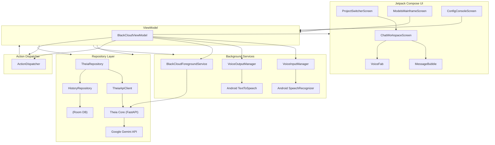

# BlackCloud_Theia Android Shell

BlackCloud_Theia, local cihaz entegrasyonları, arka plan ses kayıt/tanıma servisleri ve harici yapay zeka entegrasyonlarını (Theia Core FastAPI / Google Gemini API) bir araya getiren modern bir mobil arayüzdür.

## 🏗️ Mimari Yapı

Uygulamanın mimari bileşenleri ve aralarındaki veri akışı aşağıdaki şemada belirtilmiştir:

## 📂 Ana Bileşenler ve Görevleri

### 1. Jetpack Compose UI
* **ProjectSwitcherScreen:** Farklı çalışma alanları (projeler) arasında dinamik geçişi sağlar.
* **ChatWorkspaceScreen:** Kullanıcı ve asistan arasındaki diyalogların, çoklu mod (ses/yazı) girişlerinin ve zengin içeriklerin (özelleştirilmiş takvim hatırlatıcı kartları gibi) yönetildiği ana ekran.
* **ModelsMainframeScreen:** Aktif yapay zeka modelinin dinamik seçimine ve yapılandırılmasına imkan tanır.
* **ConfigConsoleScreen:** Ağ ve bağlantı parametrelerinin (Base URL) dinamik olarak ayarlandığı yönetici paneli.

### 2. ViewModel & State Management
* **BlackCloudViewModel:** UI durumunu (StateFlow) barındıran kontrol yapısıdır. Konuşma akışını, ses giriş/çıkış entegrasyonlarını, yerel eylemleri ve repo veri saklama süreçlerini koordine eder.

### 3. Veri ve Servis Katmanları (Repository & APIs)
* **HistoryRepository & Room DB:** Sürdürülebilir konuşma geçmişi ve proje veri tabanını çevrimdışı önbellekleme desteği ile yerel SQLite üzerinde saklar.
* **TheiaApiClient & TheiaRepository:** Yerel FastAPI (Theia Core) sunucusu ile asenkron SSE (Server-Sent Events) veri akışını yönetir.

### 4. Arka Plan Servisleri & Entegrasyonlar
* **BlackCloudForegroundService:** Sürekli dinleme ve işlem yetenekleri için Android ön plan servisini yönetir.
* **VoiceInput & VoiceOutput (TTS/STT):** Cihazın kendi konuşma-düzeç (SpeechRecognizer) ve seslendirme (TextToSpeech) donanım yeteneklerini harmanlar.
* **ActionDispatcher:** Asistandan gelen eylemleri yorumlayarak yerel takvim kurgulama, bildirim tetikleme veya sesli komut süreçlerini işletir.
