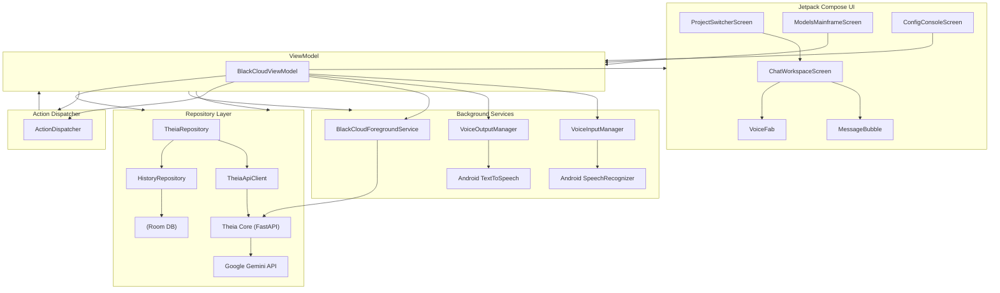

<div align="center">
  
</div>

# BlackCloud_Theia

> **The AI shell that preserves your memories** – A Jetpack Compose based Android application that interacts with a local Theia core (FastAPI) and Google Gemini API to provide a conversational AI experience with persistent memory, voice input/output, and project‑aware contexts.

---

## 🏗️ Architecture



---

## 📦 Tech Stack

- **Language**: Kotlin (Coroutines, Flow)
- **UI**: Jetpack Compose (Material3)
- **Architecture**: MVVM with StateFlow
- **Networking**: Retrofit + OkHttp (Server‑Sent Events)
- **Local DB**: Room (SQLite) for chat history & config
- **Dependency Injection**: Manual (constructors)
- **Background**: Foreground Service (keeps Theia core alive)
- **Voice**: Android SpeechRecognizer & TextToSpeech
- **Build**: Gradle Kotlin DSL (`build.gradle.kts`) with version catalog
- **AI Backend**: Local FastAPI (`Theia Core`) → Google Gemini API
- **Config**: `.env` file (API key) + SharedPreferences

---

## 🛠️ Prerequisites

- [Android Studio](https://developer.android.com/studio) (Arctic Fox or newer)
- JDK 17 (bundled with recent Android Studio)
- A **Gemini API key** (from [Google AI Studio](https://aistudio.google.com/))
- An Android emulator (API 24+) or a physical device with USB debugging enabled

---

## 🚀 Getting Started

1. **Clone the repository**
   ```bash
   git clone https://github.com/ismailkarabulut-lang/BlackCloud_Theia.git
   cd BlackCloud_Theia
   ```

2. **Create environment file**
   ```bash
   cp .env.example .env
   ```
   Edit `.env` and set your Gemini API key:
   ```dotenv
   GEMINI_API_KEY=your_actual_gemini_key_here
   ```

3. **Adjust build configuration**
   Open `app/build.gradle.kts` (or the module’s build file) and **remove** the following line (if present):
   ```kotlin
   signingConfig = signingConfigs.getByName("debugConfig")
   ```
   > This line causes a build error unless you have a signing config defined. Removing it lets the debug variant build with the default debug keystore.

4. **Sync the project**
   - In Android Studio: `File → Sync Project with Gradle Files`
   - Or run `./gradlew assembleDebug` from the terminal.

5. **Run the app**
   - Select an emulator or connect a physical device.
   - Click **Run** (▶️) in Android Studio.

6. **First launch**
   - The app will open to the **Project Switcher** screen.
   - Tap a project (or “General Chat”) to start a conversation.
   - Use the mic button for voice input or type manually.
   - Assistant responses are spoken back via TTS (if enabled).

---

## 🧪 Testing

- Unit tests reside in `app/src/test/java/...`.
- Run them with:
  ```bash
  ./gradlew test
  ```
- UI tests (Compose) can be added under `androidTest` using `composeTestRule`.

---

## 🤝 Contributing

1. Fork the repository.
2. Create a feature branch: `git checkout -b feature/awesome-idea`
3. Commit your changes: `git commit -m "Add awesome feature"`
4. Push to the branch: `git push origin feature/awesome-idea`
5. Open a Pull Request.

Please follow the existing Kotlin style and keep composables small and pure.

---

## 📄 License

This project is licensed under the MIT License – see the [LICENSE](LICENSE) file for details.

---

## 🙏 Acknowledgments

- [Google Gemini API](https://ai.google.dev/gemini-api) for the powerful LLM backend.
- [Jetpack Compose](https://developer.android.com/jetpack/compose) for modern UI development.
- Theia core (FastAPI) – local orchestrator managing memory and model routing.

---

*Happy coding & may your memories always be preserved!* 🚀
